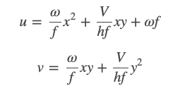

# DashCamp_CarSpeed

## Introduction

This repos is an attempt to address the commaai challenge. The challenge is  to predict the car speed with recorded videos from Dash Cam located under the mirror in front of a car. Check this link for more details about the challenge and downloading the data: [speedchallenge](https://github.com/commaai/speedchallenge).

## Optical Flow  

Based on previous attempts, one of the fastest approach in terms of training and performance is to apply the **Optical flow** concept.

Optical flow is one of the most basic concepts in computer vision, and refers to the apparent motion of objects in the image due to the relative motion between the camera and the scene.

Using Optical flow, can calculate the two components of speed(u,v) using the following equations: 

where **V** and **\omega** are the linear and angular velocities of the camera and **h** is the distance between the camera and the plane(road).

In this approach the angular velocity is neglected and focused on the linear velocity. for more details, can take a look at this blog and its paper references:[Car speed estimation from a windshild camera](https://nicolovaligi.com/car-speed-estimation-windshield-camera.html).

## Performance   

The train dataset(train.mp4) is divided into the data into **train(95%) and validation(5%)**. 
The mean squared error for train and validation are as follows: 
- Training dataset - 4.7
- Validation dataset - 2.66

## Plot 

### The training graph:

 

### The valiation graph: 

## Test speed prediction(the ground truth is not released publicly)
The speed prediction for test video(test.mp4) is generated and saved in this repo as **test.txt**.

## Running the code

First, down;apd the data folder [speedchallenge](https://github.com/commaai/speedchallenge). Then just run the speed_challenge.py (make sure tools.py is avaiable in the same directory). 

